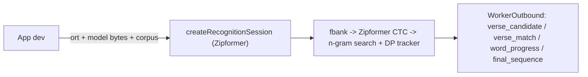

# Tilawa

Offline Quran verse recognition — give it 16kHz audio, get `surah:ayah`. Fully on-device (web / node / React Native).

This repo ships two things:

- **`@tilawa/core`** (`packages/core/`) — the SDK. Pure TypeScript, zero native deps. Default engine: streaming Zipformer2-CTC over tajweed phonemes (`src/recitation/`). Alternate engine: FastConformer text CTC. The app dev passes in their `onnxruntime` build; the SDK never imports it.
- **Web demo** (`web/`) — live browser recitation demo that consumes `@tilawa/core` as its regression guard.

The Python research/training/benchmark harness lives under `lab/` and has its own `lab/AGENTS.md`. Model weights are proven out there, then their logic graduates into the SDK.

## Layout

```
packages/core/     # @tilawa/core SDK (the shipped product)
  src/
    index.ts             # createRecognitionSession (engine switch), createTilawaSession, TilawaAssets
    recitation/          # default Zipformer engine
      session.ts         #   ZipformerSession / createZipformerSession — {ort, model} or {session, Tensor}
      zipformerRunner.ts #   ONNX I/O over the injected ort namespace
      fbank.ts, ctcDecoder.ts, search.ts, tracker.ts, engine.ts, emission.ts, correction.ts, ...
      zipformer-io.json  #   bundled I/O manifest (DEFAULT_ZIPFORMER_IO)
    session.ts           # SessionRunner seam — FastConformer only (type-only, no onnxruntime)
    quran-db.ts          # QuranDB — display text + FastConformer verse matching
    tracker.ts, text-ctc-decode.ts, quran-text-adapter.ts, ctc-rescore.ts  # FastConformer pipeline
    levenshtein.ts, normalizer.ts, types.ts  # shared helpers + WorkerOutbound event union
  test/                  # deterministic vitest (no ONNX)
  examples/
    browser/index.html   # no-bundler page: import map -> dist + onnxruntime-web, file + mic input
    browser/test.mjs     # headless Chromium regression over test_corpus (npm run test:browser)
    session-*.ts, react-native.md  # copy-paste runtime adapters
web/                     # live browser demo (Vite + worker), consumes @tilawa/core src
  frontend/src/worker/zipformer-backend.ts  # the web Zipformer host (onnxruntime-web)
  frontend/scripts/fetch-zipformer-assets.sh  # model + corpus -> public/ (gitignored, NPL-1.2)
lab/                     # Python research/training/benchmark harness — see lab/AGENTS.md
.github/workflows/ci.yml # core (vitest), browser (test:browser), demo (build)
README.md, Dockerfile, LICENSE
```

`README.md` at the root is the SDK's published README. `packages/core/README.md` is a gitignored copy made by `npm run sync-docs` at pack time; edit the root file.

## SDK architecture



- **Zipformer (default)** — the app passes the `ort` namespace plus model bytes (web/node), or an already-created `session` plus `Tensor` (React Native, where sessions load from a path). The SDK builds the ONNX session, runs Kaldi fbank in TS, and feeds the streaming Zipformer. The phoneme corpus (`zipformer_quran.json`) is required and not bundled. `quran.json` is display text only.
- **FastConformer (alternate)** — the app writes a `SessionRunner`: input `audio_signal [1,N]` float32 + `length`, output `[1,T,vocab]` logprobs, preprocessing in-graph. Needs `{ vocab, quranCtcTokens, quran }` assets.

Both engines emit the same `WorkerOutbound` union through `onEvent` / `onOutput` and as the return value of `feed()` / `stop()`.

### Public surface (`@tilawa/core`)

- `createRecognitionSession(options) -> RecognitionSession`: `feed(chunk)`, `stop()` / `flush()`, `reset()`, `engine`, `zipformer`, `fastconformer`. `engine` defaults to `"zipformer"`.
- `createZipformerSession(options) -> ZipformerSession`: adds `transcript`, `verses`, `verdicts()`, `setMode()`, `correct()`, `engineState`. Options: `ort`+`model` or `session`+`Tensor`, `corpus`, `quran?`, `io?`, `executionProviders?`, `onEvent?`, tuning knobs.
- `createTilawaSession(runner, assets, options?) -> TilawaSession` (FastConformer): `transcribe()`, `transcribeRaw()`, `feed()`, `reset()`, `setConfig()`, `getConfig()`, `db`, `decoder`.
- Types: `WorkerOutbound` and its message types, `SessionRunner`, `SessionOutput`, `TilawaAssets`, `TilawaPrediction`, `StreamingConfig` + presets, `QuranVerse`, `QuranDB`.

`feed`, `stop` and `reset` on one session must never overlap: they share the streaming encoder state. Serialize them (a promise queue is enough).

## Build & test the SDK

```bash
cd packages/core
npm install                # `prepare` builds dist/
npx vitest run             # deterministic tests (no ONNX)
npm run test:browser       # rebuilds dist, runs examples/browser in headless Chromium
```

`test:browser` needs the model + corpus in `web/frontend/public` (`web/frontend/scripts/fetch-zipformer-assets.sh`) and a Playwright browser (`npx playwright install chromium`, or `PW_CHANNEL=chrome` to use installed Chrome). `-- --all` runs every mp3/wav sample in `lab/benchmark/test_corpus`.

`vitest` and `test:browser` must be green before merge. CI (`.github/workflows/ci.yml`) runs both plus the demo build.

## Run the web demo

The demo is the SDK's regression guard: if it still recognizes recitation against `@tilawa/core`, the SDK is correct.

```bash
cd web/frontend
npm install
npm run dev                # vite dev server
npm run build              # tsc && vite build
npm run build:server && npm run start   # bundled node server (dist-server/index.mjs)
```

`Dockerfile` at the root builds and serves this demo.

### Streaming validation

```bash
cd web/frontend
npm run test:streaming            # Zipformer recordings, one run
npm run test:streaming:matrix     # three repeated runs
npm run test:correction           # tracking + correction recording regression
```

## Making changes

- **SDK core change** (decode / matcher / tracker) → edit `packages/core/src/`. Add/extend a `packages/core/test/*.test.ts` that deterministically exercises it without ONNX. `npx vitest run` stays green. If the change touches the Zipformer engine, the public API, or the build output, run `npm run test:browser` too.
- **Demo change** → edit `web/frontend/src/`. Verify `npm run build` typechecks and the demo still recognizes recitation.
- **New model / matching strategy / training** → that's lab work. See `lab/AGENTS.md`. Nothing in `lab/` may import from `packages/` or `web/`, and vice versa.

## Worktree + merge discipline

Develop every change in a worktree under `./.worktrees/`, then merge back with `--no-ff`.

```bash
git worktree add .worktrees/<name> -b <name>
cd .worktrees/<name>
# ... implement, test (vitest + test:browser + demo build) ...
git commit                 # subject: "<area>: <what changed>" (≤72 chars); body: the why + before/after
git merge <name> --no-ff -m "Merge branch '<name>': ..."
git worktree remove .worktrees/<name>
```

Never skip hooks or bypass signing.
